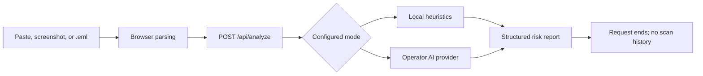

<div align="center">

# Maillume

**Shine a light on suspicious email.**

An open-source, privacy-first email risk scanner for people who want a clear second opinion before they click, reply, or pay.

[Website](https://maillume.io) · [Open scanner](https://app.maillume.io) · [Documentation](docs/architecture.md) · [Roadmap](docs/roadmap.md)

[](https://github.com/MatthiasBusscher/Maillume/actions/workflows/ci.yml)
[](LICENSE)
[](https://nextjs.org/)
[](docs/roadmap.md)

</div>


Maillume turns suspicious patterns, links, sender clues, and pressure tactics into an explainable risk report. It supports pasted text, screenshots, and `.eml` files without creating scan history. Heuristic analysis is the default and needs no AI key.

> This is an automated risk assessment and should not be considered a guarantee.

## What Works Today

| Capability | Status |
| --- | --- |
| Anonymous English/Dutch web scanner | Release candidate |
| Paste, screenshot OCR, and `.eml` input | Available |
| Local heuristic risk assessment | Available |
| Self-hosted AI with your own provider key | Available from source |
| Google accounts and hosted API keys | Implemented; production acceptance in progress |
| Chrome, Gmail, and Outlook integrations | Source beta; marketplace publication pending |
| Maintainer-hosted AI and payments | Not implemented |

The repository is a private-beta release candidate. [Production acceptance](https://github.com/MatthiasBusscher/Maillume/issues/38), [integration publication](https://github.com/MatthiasBusscher/Maillume/issues/39), and the [release rehearsal](https://github.com/MatthiasBusscher/Maillume/issues/40) remain open before broad launch.

## Why Maillume

- **Explainable:** shows the score, suspicious signals, detected links, and a practical next action.
- **Private by design:** the application does not create scan history or use ordinary scans as training data.
- **Useful without an account:** anonymous heuristic scanning is the permanent free core.
- **Portable:** run the same Next.js application locally, in Docker, or on your own infrastructure.
- **Provider-flexible:** self-hosters can use OpenAI, Anthropic, or an OpenAI-compatible endpoint with their own server-side key.
- **Cautious:** every result is framed as decision support, never certainty.

## Privacy Boundary

Screenshot OCR and `.eml` parsing run in the browser. The raw image or file is not uploaded; normalized text is sent to the selected deployment for the current assessment. The application does not write email bodies, senders, subjects, links, screenshots, `.eml` files, prompts, or results to scan history.

Self-hosted AI mode sends normalized scan text to the provider selected by the operator. That operator is responsible for the provider's processing terms, retention settings, budgets, and regional requirements. See the [privacy architecture](docs/hosted-service.md) and [security review](docs/security-privacy-review.md).

## Quick Start

Requirements: Node.js 22+ and npm.

```bash
git clone https://github.com/MatthiasBusscher/Maillume.git
cd maillume
npm install
cp .env.example .env.local
npm run dev
```

Open `http://localhost:3000` for the website or `http://localhost:3000/app` for the scanner. Heuristic mode needs no account, database, or AI key.

## How It Works



The response contract is shared across modes:

```ts
type EmailAnalysisResult = {
  risk_level: "low" | "medium" | "high";
  risk_score: number;
  suspicious_signals: string[];
  detected_links: string[];
  recommended_action: string;
  short_explanation: string;
};
```

## Self-Hosted AI

The hosted release is designed to run without a project-owned AI key; production acceptance must verify that live configuration. A self-hoster can opt into AI analysis with server-only variables:

```bash
ANALYSIS_MODE=ai
AI_PROVIDER=openai-compatible
AI_BASE_URL=https://your-provider.example/v1
AI_API_KEY=your-own-provider-key
AI_MODEL=your-model-id
```

Never prefix provider secrets with `NEXT_PUBLIC_`. Configure provider budgets and deployment-level rate limiting before exposing AI mode publicly. See [AI cost controls](docs/cost-controls.md).

## Docker

For a local production-style image:

```bash
docker build \
  --build-arg NEXT_PUBLIC_MARKETING_URL=http://localhost:3000 \
  --build-arg NEXT_PUBLIC_APP_URL=http://localhost:3000/app \
  -t maillume:local .

docker run --rm -p 3000:3000 \
  -e ANALYSIS_MODE=heuristic \
  maillume:local
```

The production image uses Next.js standalone output, a non-root user, and a health endpoint. The production Compose stack additionally enforces a read-only filesystem, dropped capabilities, and `no-new-privileges`. See the [deployment guide](docs/deployment.md) for Cloudflare Tunnel and portable hosting.

## Development

```bash
npm run typecheck
npm run lint
npm run test:analysis
npm run test:security
npm run test:integrations
npm run test:smoke
npm run build
```

Reusable scoring fixtures must be synthetic or fully sanitized. Never commit real private email content, inbox screenshots, raw `.eml` files, private headers, or credentials.

## Project Guides

- [Architecture](docs/architecture.md)
- [Deployment and self-hosting](docs/deployment.md)
- [Integrations and hosted API](docs/integrations.md)
- [Integration marketplace packet](docs/integration-publication.md)
- [Evaluation and calibration](docs/evaluation.md)
- [Operations](docs/operations.md)
- [Launch checklist](docs/launch-checklist.md)
- [Product roadmap](docs/roadmap.md)

## Contributing

Read [CONTRIBUTING.md](CONTRIBUTING.md) before opening a pull request. Bug reports and detection examples must use synthetic data. Product changes should preserve anonymous scanning, zero scan history, server-only secrets, and the required uncertainty disclaimer.

Security issues should use GitHub private vulnerability reporting as described in [SECURITY.md](SECURITY.md). Do not place exploit details, credentials, or private email content in a public issue.

## License

Maillume is free software licensed under [GNU AGPL-3.0-only](LICENSE). See [NOTICE](NOTICE) for attribution and warranty information.

If you offer a modified version over a network, review the AGPL source-availability obligations for that deployment. This is a plain-language reminder, not legal advice.
