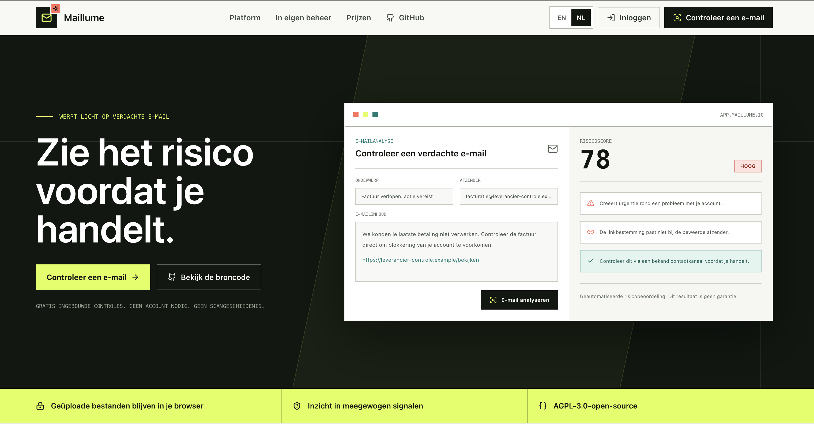
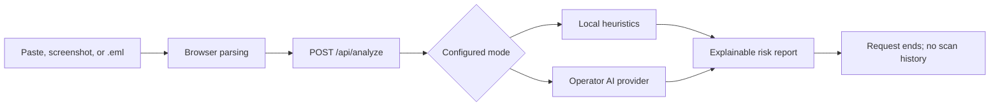

<div align="center">

# Maillume

**An open-source second opinion for suspicious email.**

Understand the warning signs in an email before you click, reply, share information, or pay.

[Try Maillume](https://app.maillume.io) · [Website](https://maillume.io) · [Documentation](docs/architecture.md) · [Roadmap](docs/roadmap.md) · [Contributing](CONTRIBUTING.md)

[](https://github.com/MatthiasBusscher/Maillume/actions/workflows/ci.yml)
[](LICENSE)
[](https://nextjs.org/)
[](docs/roadmap.md)

</div>



## About Maillume

Suspicious email is hard to judge when it looks just convincing enough. Maillume makes that decision easier by turning sender clues, pressure tactics, links, and message patterns into a plain-language risk report.

Paste an email, add a screenshot, or open an exported `.eml` file. Maillume shows what it noticed, how strongly the signals affect the score, and what to do next. The final decision always stays with the user.

> This is an automated risk assessment and should not be considered a guarantee.

## Key Capabilities

- **Explainable results:** risk score, risk level, suspicious signals, detected links, and a practical next action.
- **Versioned risk index:** the score is a capped, explainable index of observed evidence, not a probability that a message is malicious.
- **Three input paths:** pasted text, browser-side screenshot OCR, and browser-side `.eml` parsing.
- **No scan history:** email content and completed assessments are not written to a scan database.
- **Useful without an account:** anonymous heuristic scanning is the permanent free core.
- **Self-hostable:** run the complete scanner in Docker and optionally connect your own AI provider.
- **Bilingual from the start:** the web interface and Chrome extension source beta support English and Dutch.
- **Built in the open:** AGPL-3.0 source, public issues, security guidance, and a documented result contract.

## Project Status

Maillume is a release candidate preparing for private beta. The scanner works today; production acceptance and Chrome Web Store publication remain explicit launch gates.

| Capability | Status |
| --- | --- |
| Anonymous English and Dutch web scanner | Release candidate |
| Paste, screenshot OCR, and `.eml` input | Available |
| Local heuristic assessment | Available |
| Self-hosted AI with an operator-owned key | Available from source |
| Email/Google accounts, TOTP 2FA, and hosted API keys | Implemented; production acceptance in progress |
| Chrome extension | Source beta; Chrome Web Store publication pending |
| Maintainer-hosted AI and payments | Not implemented |

Follow [production acceptance](https://github.com/MatthiasBusscher/Maillume/issues/38), [integration publication](https://github.com/MatthiasBusscher/Maillume/issues/39), and the [private-beta rehearsal](https://github.com/MatthiasBusscher/Maillume/issues/40) on GitHub.

## Quick Start

Requirements: Node.js 22+ and npm.

```bash
git clone https://github.com/MatthiasBusscher/Maillume.git
cd Maillume
npm install
cp .env.example .env.local
npm run dev
```

Open `http://localhost:3000/app`. Heuristic mode needs no account, database, or AI key.

## Privacy Model

Screenshot OCR and `.eml` parsing run in the browser. The source file is not uploaded. The normalized text needed for the current assessment is sent to the selected Maillume deployment and discarded when the request ends.

Maillume does not create scan history and does not use ordinary scans as training data. It does not write email bodies, sender details, subjects, links, screenshots, `.eml` files, prompts, or completed results to Supabase.

Self-hosted AI mode sends normalized scan text to the provider selected by the operator. The operator controls that provider relationship, including retention settings, budgets, and regional requirements. Read the [privacy architecture](docs/hosted-service.md) and [security review](docs/security-privacy-review.md) before running a public deployment.

## Integrations

The Chrome extension is Maillume's only planned inbox integration. It is available for source testing but must not be presented as Chrome Web Store-ready until publication checks pass.

| Surface | Access boundary | Local verification |
| --- | --- | --- |
| Chrome extension | Selected text, or the visibly open message in a supported webmail client when unambiguous | Manifest V3 load test, permission tests, and packaged-artifact checks |

Build the Chrome Web Store candidate and checksum with:

```bash
npm run package:integrations
```

The release packaging command produces the Chrome artifact. Chrome Web Store acceptance is tracked in the [publication packet](docs/integration-publication.md).

## How It Works



Both analysis modes return the same structured contract:

```ts
type EmailAnalysisResult = {
  classification: "likely_phishing" | "likely_spam" | "likely_legitimate" | "uncertain";
  risk_level: "low" | "medium" | "high";
  risk_score: number;
  score_factors: Array<{
    id: string;
    family: "identity" | "destination" | "intent" | "delivery" | "style";
    contribution: number;
    label: string;
  }>;
  suspicious_signals: string[];
  detected_links: string[];
  recommended_action: string;
  short_explanation: string;
};
```

`analysis_version` is currently `analysis-v2.1`. Applied factor contributions always sum to `risk_score`. Maillume derives classification, level, links, and score server-side; optional AI providers return stable evidence IDs instead of choosing a number.

## Self-Hosting and AI

Heuristic mode is the default. A self-hoster can opt into AI analysis with server-only configuration:

```bash
ANALYSIS_MODE=ai
AI_PROVIDER=openai-compatible
AI_BASE_URL=https://your-provider.example/v1
AI_ALLOWED_HOSTS=your-provider.example
AI_API_KEY=your-own-provider-key
AI_MODEL=your-model-id
```

Never prefix provider secrets with `NEXT_PUBLIC_`. Configure provider budgets and deployment-level rate limiting before exposing AI mode publicly. See [AI cost controls](docs/cost-controls.md).

For a production-style local container:

```bash
docker build \
  --build-arg NEXT_PUBLIC_MARKETING_URL=http://localhost:3000 \
  --build-arg NEXT_PUBLIC_APP_URL=http://localhost:3000/app \
  -t maillume:local .

docker run --rm -p 3000:3000 \
  -e ANALYSIS_MODE=heuristic \
  maillume:local
```

See the [deployment guide](docs/deployment.md) for Docker Compose, Cloudflare Tunnel, and portable hosting.

## Development

```bash
npm run typecheck
npm run lint
npm run test:analysis
npm run test:security
npm run test:integrations
npm run test:extension
npm run test:smoke
npm run build
```

Reusable scoring fixtures must be synthetic or fully sanitized. The CI corpus contains 300 English/Dutch synthetic cases split by scenario into development and locked sets. It is a regression benchmark, not evidence of real-world accuracy. Never commit real private email content, inbox screenshots, raw `.eml` files, private headers, or credentials.

Useful guides: [architecture](docs/architecture.md), [authentication](docs/authentication.md), [Google sign-in identity](docs/google-oauth-branding.md), [evaluation](docs/evaluation.md), [operations](docs/operations.md), [launch checklist](docs/launch-checklist.md), and [roadmap](docs/roadmap.md).

## Community and Security

- Read [CONTRIBUTING.md](CONTRIBUTING.md) before opening a pull request.
- Use [GitHub Issues](https://github.com/MatthiasBusscher/Maillume/issues) for reproducible bugs and product proposals.
- Keep all examples synthetic and free of private inbox data.
- Report vulnerabilities privately as described in [SECURITY.md](SECURITY.md).

## License

Maillume is licensed under [GNU AGPL-3.0-only](LICENSE). See [NOTICE](NOTICE) for attribution and warranty information.

If you offer a modified version over a network, review the AGPL source-availability obligations for that deployment. This is a plain-language reminder, not legal advice.
