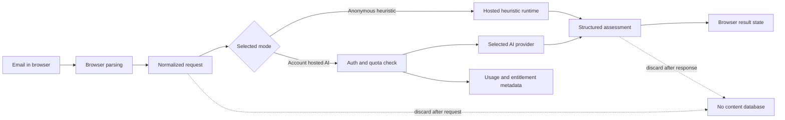

# Hosted Service Architecture

Status: active architecture record. Optional Google authentication, hashed integration API keys, aggregate quotas, and source-beta Chrome/Gmail/Outlook integrations are implemented. Hosted AI, paid entitlements, and payments are not implemented.

## Decision Summary

Maillume remains an open-source, privacy-first scanner first and a hosted service second.

- Anonymous heuristic scans stay free and do not require an account.
- Normal scans are processed for the current assessment only. They are not reused for analytics, model training, or evaluation fixtures.
- A free account is optional and is currently needed only to create revocable integration API keys. Hosted AI allowances and saved preferences remain future features.
- A paid hosted plan may sell managed AI capacity, integrations, and convenience. It must have explicit usage limits.
- Self-hosting and bring-your-own-key AI remain free under the repository license.
- Raw email content, screenshots, `.eml` files, OCR text, links, and assessment results are not retained after scoring.
- Detection improvements use synthetic fixtures and optional non-content feedback. Production emails do not become a dataset.

## Product Boundaries

| Mode | Account | Analyzer | Planning limit | Content retention |
| --- | --- | --- | --- | --- |
| Anonymous free | No | Hosted heuristic runtime | No monthly entitlement; fair-use request rate limits | Request lifetime only |
| Free account API | Yes | Hosted heuristic runtime | 100 authenticated integration calls/month during beta | Request lifetime only |
| Plus account | Yes | Heuristic plus hosted AI | Hypothesis: 20 AI scans/day and 100/month | Request lifetime only |
| Self-hosted | Determined by installer | Heuristic or installer-selected AI provider | Determined and paid by installer | Determined by installer; no-storage remains the project default |

The free and Plus allowances are hypotheses for cost validation, not a public pricing promise. There are no automatic overages, rollover credits, unlimited AI claims, scan history, or team features in this phase.

## Data Flow



Screenshot OCR and `.eml` parsing happen in the browser. The hosted API receives normalized subject, sender, and body text, not the original file. Hosted AI mode transmits that normalized text to the selected provider only after authentication and a successful quota reservation.

### Data Inventory

| Data | Processed where | Retained by Maillume | Target retention |
| --- | --- | --- | --- |
| Raw screenshot or `.eml` file | Browser memory | No | Cleared after parsing or page close |
| Subject, sender, body, OCR text, links | Request memory; selected AI provider in hosted AI mode | No | Discarded after the response |
| Structured assessment | Browser state and response memory | No | Discarded on refresh or navigation |
| Account identity and preferences | Supabase Auth and application database | Yes, for account features only | Account lifetime; deletion workflow removes application data |
| Integration API key and quota counters | Application database | Yes | Key metadata until revocation/account deletion; aggregate monthly counts for up to 13 months |
| Quota reservation metadata (account/key IDs, period, timestamps) | Application database | Yes, without scan content or results | Finalized or refunded during the request; eligible for deletion after 10 minutes by a five-minute purge job |
| Billing customer and subscription references | Application database and payment provider | Yes, without payment-card data | Required account and financial retention periods |
| Operational request metadata | Hosting and security systems | Yes, without message content or query strings | Target maximum 14 days |
| Optional non-content feedback | Feedback store | Yes | Maximum 90 days before aggregation or deletion |

Before hosted accounts launch, actual backup expiry, processor retention, and infrastructure log settings must be verified. Product copy must not promise deletion faster than the deployed services can deliver.

## Dataset And Feedback Policy

### Standard Scan Path

The standard scan path does not create a dataset. This applies to anonymous, free-account, Plus, and self-hosted default modes.

- Do not sample, retain, or review email content from scans.
- Do not preselect an improvement checkbox.
- Do not make free access conditional on contributing data.
- Do not store sender addresses, subjects, message bodies, URLs, attachments, screenshots, `.eml` files, or model prompts for later evaluation.
- Do not describe ordinary service processing as consent for product improvement.

### Safe Improvement Path

The first improvement mechanism should collect optional non-content feedback only:

- whether the result was helpful;
- whether the user expected phishing, spam, or legitimate;
- false-positive or false-negative selection;
- UI language, input mode, analyzer version, and returned score band;
- user-selected high-level pattern categories such as urgency, impersonation, credential request, payment request, or suspicious link.

The feedback screen must state exactly what will be sent and confirm that no email text, sender, subject, or link is included. Declining feedback must have no effect on scanner access.

Maintainers use these reports to author new synthetic fixtures with reserved domains and invented identities. Public issues, tests, and repository history continue to accept synthetic or fully sanitized examples only.

Accepting real or merely auto-redacted emails into a research dataset is a separate future project. It requires a new privacy and legal review, a defined lawful basis, explicit and withdrawable participation, third-party-data handling, access controls, deletion procedures, and a retention schedule. It is not approved by this architecture decision.

This separation follows the EU data-protection principles of purpose limitation, data minimization, and storage limitation. If a future research program relies on consent, that consent must be freely given, specific, informed, unambiguous, and withdrawable without losing access to the scanner. See the [European Commission overview](https://commission.europa.eu/law/law-topic/data-protection/rules-business-and-organisations/principles-gdpr/overview-principles/what-data-can-we-process-and-under-which-conditions_en) and [European Data Protection Board consent guidance](https://www.edpb.europa.eu/sme-data-protection-guide/faq-frequently-asked-questions/answer/how-can-i-obtain-valid-consent_en). This architecture record is not legal advice; the deployed service still needs an appropriate professional review.

## Hosted AI Cost Model

Provider prices vary, so the application must calculate cost from measured token usage instead of hardcoding a provider name into plan logic.

```text
estimated_scan_cost =
  (input_tokens / 1,000,000 * provider_input_price) +
  (output_tokens / 1,000,000 * provider_output_price)
```

Planning envelope:

- Typical scan: up to 2,000 input tokens and 400 output tokens.
- Maximum accepted body: 20,000 characters, plus the system prompt and response schema.
- Maximum configured output: 800 tokens by default.
- Target typical provider cost: no more than EUR 0.005 per scan.
- Hard planning ceiling: no more than EUR 0.02 per scan at the selected model and token limits.

At the hard ceiling, 5 free AI scans cost at most EUR 0.10 per active free user per month and 100 Plus scans cost at most EUR 2.00 per subscriber per month before hosting, payment, support, and tax costs. These are planning estimates and must be replaced with a measured synthetic load test before launch.

### Hard Limits

- Free account: 2 hosted AI scans/day and 5/month.
- Plus account: 20 hosted AI scans/day and 100/month.
- No paid overages during beta.
- Reserve quota atomically before the provider request.
- Refund user quota on a controlled provider failure, while still recording provider cost against the global budget when a billable call occurred.
- Enforce limits in a shared persistent store. The existing in-memory limiter is not sufficient for hosted billing.
- Allow only reviewed provider/model combinations and retain the existing input and output token caps.

Initial beta global budget hypothesis:

- Monthly hosted AI budget: EUR 50.
- Notify maintainers at 50 percent.
- Disable new free AI usage at 75 percent while keeping heuristic scans available.
- Disable all hosted AI at 100 percent and fall back to clearly labeled heuristic analysis.

The application database is authoritative for entitlements and hard quota enforcement. Payment-provider meters may support reconciliation and billing, but they must not be the only abuse control.

## Pricing Hypothesis

| Plan | Monthly price hypothesis | Included service |
| --- | --- | --- |
| Anonymous | EUR 0 | Heuristic scanning without an account |
| Free account | EUR 0 | Heuristic scanning plus 100 authenticated integration API calls/month during beta |
| Plus | EUR 9/month | Planning hypothesis for hosted AI, higher API limits, managed integration convenience, and support |
| Self-hosted | EUR 0 from the project | Full source code and bring-your-own-key provider usage |

The Plus price is a validation target, not final public copy. Launch pricing requires measured cost, payment fees, hosting costs, tax handling, support expectations, and user interviews. Team plans remain out of scope.

## Account And Failure Behavior

### Account Deletion

- Revoke active sessions immediately.
- Delete the application profile, preferences, quota state, and entitlement references.
- Request deletion or detachment of the payment customer where allowed.
- Explain that payment records may remain with the payment processor where legally required.
- Do not perform scan-history deletion because the hosted service does not create scan history.

### Quota Reset

- Free quotas reset at 00:00 UTC on the first day of each calendar month.
- Plus quotas follow the paid subscription billing period.
- Daily limits use UTC and do not roll over.
- Duplicate requests and retries use idempotency keys so they cannot consume multiple credits accidentally.

### Failed Payment

- Mark the entitlement as past due from verified payment-provider webhooks.
- Allow a maximum three-day grace period during beta.
- Downgrade to the free allowance after the grace period without deleting the account.
- Keep anonymous heuristic scanning available.

### Provider Outage Or Budget Stop

- Show that hosted AI is unavailable and identify any heuristic fallback as heuristic analysis.
- Never present a fallback result as an AI result.
- Refund user quota for controlled provider failures.
- Keep anonymous and account heuristic scanning available.
- Do not queue email content for later processing.

## Draft Privacy Disclosure

Hosted AI disclosure shown immediately before the first hosted AI scan:

> When you choose hosted AI analysis, the subject, sender, and message text shown in the scanner are sent to the named AI provider only to produce this assessment. Maillume does not save this content or use it to build a training dataset. The provider and its current processing terms are shown before you continue. You can always use heuristic scanning without an account or AI provider.

Optional feedback disclosure:

> Help improve detection by sharing feedback about the result. We will receive your selected classification, signal categories, language, input mode, analyzer version, and score band. We will not receive the email text, sender, subject, links, attachments, screenshot, or `.eml` file. Sharing feedback is optional and does not affect free access.

The hosted AI action must fail closed if the deployment cannot identify the provider and link to its current processing terms.

## License Decision

The repository uses GNU AGPL-3.0-only for the public beta. The license is designed for network applications and requires operators of modified network-hosted versions to offer the corresponding source to their users under its terms.

The official hosted service still competes on trust, convenience, managed provider costs, integrations, reliability, and support rather than withholding the core scanner.

No dual-license or enterprise license program exists. Adding one later may require contributor permissions, a contributor agreement, and legal review. See `docs/product-positioning.md` for the complete public-beta decision. This documentation is not legal advice.

## Go Or No-Go Record

- **Go:** public anonymous heuristic launch.
- **Go:** free self-hosting and bring-your-own-key AI.
- **Go:** privacy-preserving, non-content feedback design as a separate issue.
- **Go:** explicit-action Chrome, Gmail, and Outlook source-beta integrations using minimum practical permissions.
- **Go:** optional authentication and quota-limited heuristic integration API.
- **Hold:** maintainer-funded hosted AI.
- **Hold:** payment implementation.

Authentication, hosted AI, and billing move from hold to go only when all of these are complete:

- provider and model pass measured cost and quality evaluation using synthetic fixtures;
- provider retention, training use, security terms, and data-processing agreement are reviewed;
- privacy policy, terms, processor list, and hosted AI disclosure are ready;
- distributed rate limits, atomic quotas, idempotency, and the global kill switch are designed and tested;
- account deletion and billing webhook behavior have acceptance tests;
- infrastructure logs and backups are verified not to retain scan content;
- the pricing hypothesis is validated with target users;
- a security and privacy review approves the deployed data flow.
